# Preprocessing MEA Data

This notebook preprocesses the MEA data by extracting files, transforming data into a 3D array, and visualizing the data.


```python
# Extracting and Processing Data
import os
import glob
import zipfile
import time
import numpy as np
from tqdm import tqdm
from scipy.signal import find_peaks

# Project-specific imports 
import sys
import McsPy
import McsPy.McsData
import McsPy.McsCMOS

# Data Visualization
import matplotlib.pyplot as plt

# Data Preparation for ML
import pandas as pd
from sklearn.model_selection import train_test_split

# Building and Training ML Models
import torch
import torch.nn as nn
import torch.nn.functional as F
from torch.utils.data import Dataset, DataLoader, Subset

# Additional Utilities
from collections import Counter
from sklearn.metrics import confusion_matrix, classification_report

```


```python
# Helper functions
def get_ch_from_id(id):
    return [key for key, value in channels_dict.items() if value == id][0] - 1

```


```python
def extract_zip_files(from_folder=".", to_folder="./MEA recordings"):
    from_folder = os.path.join(from_folder, "*.zip")
    files = glob.glob(from_folder)
    
    for file in files:
        with zipfile.ZipFile(file, 'r') as zip_ref:
            # Extract each file individually
            for member in zip_ref.namelist():
                # Flatten the directory structure
                filename = os.path.basename(member)
                if filename:  # Avoid directories
                    destination = os.path.join(to_folder, filename)
                    # Ensure destination folder exists
                    os.makedirs(os.path.dirname(destination), exist_ok=True)
                    with zip_ref.open(member) as source_file, open(destination, "wb") as output_file:
                        output_file.write(source_file.read())

    print(f"Extracted {len(files)} zip files to {to_folder} folder")
```


```python
def extract_data_from_all_files(from_folder="./MEA recordings", to_folder=r'npy_files'):
    h5files = glob.glob(from_folder + "/*.h5")
    print(f"found {len(h5files)} h5 files in {from_folder}")
    for file in tqdm(h5files):
        transform_data_to_3d_array(file, to_folder)
    print(f"Extracted data from {len(h5files)} h5 files to {to_folder}")
```

# In MEA the channels arrange by:

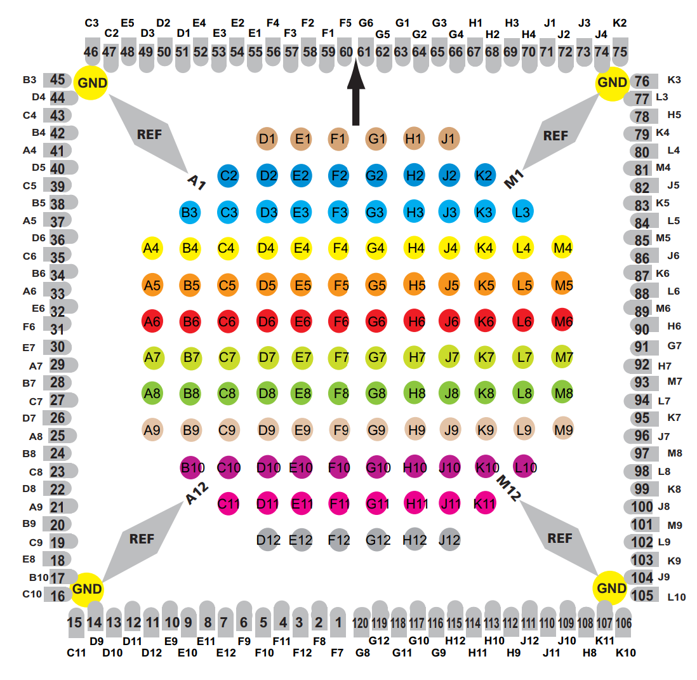

### So we are creating a 12*12 2d matching array (ids)
in light yellow are the cells which exist only in the array
<table border="1">
  <tr>
    <td style="background-color: lightyellow;">A1</td>
    <td style="background-color: lightyellow;">B1</td>
    <td style="background-color: lightyellow;">C1</td>
    <td>D1</td>
    <td>E1</td>
    <td>F1</td>
    <td>G1</td>
    <td>H1</td>
    <td>J1</td>
    <td style="background-color: lightyellow;">K1</td>
    <td style="background-color: lightyellow;">L1</td>
    <td style="background-color: lightyellow;">M1</td>
  </tr>
  <tr>
    <td style="background-color: lightyellow;">A2</td>
    <td style="background-color: lightyellow;">B2</td>
    <td>C2</td>
    <td>D2</td>
    <td>E2</td>
    <td>F2</td>
    <td>G2</td>
    <td>H2</td>
    <td>J2</td>
    <td>K2</td>
    <td style="background-color: lightyellow;">L2</td>
    <td style="background-color: lightyellow;">M2</td>
  </tr>
  <tr>
    <td style="background-color: lightyellow;">A3</td>
    <td>B3</td>
    <td>C3</td>
    <td>D3</td>
    <td>E3</td>
    <td>F3</td>
    <td>G3</td>
    <td>H3</td>
    <td>J3</td>
    <td>K3</td>
    <td>L3</td>
    <td style="background-color: lightyellow;">M3</td>
  </tr>
  <tr>
    <td>A4</td>
    <td>B4</td>
    <td>C4</td>
    <td>D4</td>
    <td>E4</td>
    <td>F4</td>
    <td>G4</td>
    <td>H4</td>
    <td>J4</td>
    <td>K4</td>
    <td>L4</td>
    <td>M4</td>
  </tr>
  <tr>
    <td>A5</td>
    <td>B5</td>
    <td>C5</td>
    <td>D5</td>
    <td>E5</td>
    <td>F5</td>
    <td>G5</td>
    <td>H5</td>
    <td>J5</td>
    <td>K5</td>
    <td>L5</td>
    <td>M5</td>
  </tr>
  <tr>
    <td>A6</td>
    <td>B6</td>
    <td>C6</td>
    <td>D6</td>
    <td>E6</td>
    <td>F6</td>
    <td>G6</td>
    <td>H6</td>
    <td>J6</td>
    <td>K6</td>
    <td>L6</td>
    <td>M6</td>
  </tr>
  <tr>
    <td>A7</td>
    <td>B7</td>
    <td>C7</td>
    <td>D7</td>
    <td>E7</td>
    <td>F7</td>
    <td>G7</td>
    <td>H7</td>
    <td>J7</td>
    <td>K7</td>
    <td>L7</td>
    <td>M7</td>
  </tr>
  <tr>
    <td>A8</td>
    <td>B8</td>
    <td>C8</td>
    <td>D8</td>
    <td>E8</td>
    <td>F8</td>
    <td>G8</td>
    <td>H8</td>
    <td>J8</td>
    <td>K8</td>
    <td>L8</td>
    <td>M8</td>
  </tr>
  <tr>
    <td>A9</td>
    <td>B9</td>
    <td>C9</td>
    <td>D9</td>
    <td>E9</td>
    <td>F9</td>
    <td>G9</td>
    <td>H9</td>
    <td>J9</td>
    <td>K9</td>
    <td>L9</td>
    <td>M9</td>
  </tr>
  <tr>
    <td style="background-color: lightyellow;">A10</td>
    <td>B10</td>
    <td>C10</td>
    <td>D10</td>
    <td>E10</td>
    <td>F10</td>
    <td>G10</td>
    <td>H10</td>
    <td>J10</td>
    <td>K10</td>
    <td>L10</td>
    <td style="background-color: lightyellow;">M10</td>
  </tr>
  <tr>
    <td style="background-color: lightyellow;">A11</td>
    <td style="background-color: lightyellow;">B11</td>
    <td>C11</td>
    <td>D11</td>
    <td>E11</td>
    <td>F11</td>
    <td>G11</td>
    <td>H11</td>
    <td>J11</td>
    <td>K11</td>
    <td style="background-color: lightyellow;">L11</td>
    <td style="background-color: lightyellow;">M11</td>
  </tr>
  <tr>
    <td style="background-color: lightyellow;">A12</td>
    <td style="background-color: lightyellow;">B12</td>
    <td style="background-color: lightyellow;">C12</td>
    <td>D12</td>
    <td>E12</td>
    <td>F12</td>
    <td>G12</td>
    <td>H12</td>
    <td>J12</td>
    <td style="background-color: lightyellow;">K12</td>
    <td style="background-color: lightyellow;">L12</td>
    <td style="background-color: lightyellow;">M12</td>
  </tr>
</table>


```python
def clean_noise(channel_data, sampling_frequency):
    # Calculate the threshold
    threshold = np.median(np.abs(channel_data) / 0.6745) * 5

    # Calculate the number of samples corresponding to 1 millisecond
    npulse = int(1e-3 * sampling_frequency)
    window = npulse * 3  # 3 millisecond window

    # Find positive peaks above the threshold
    positive_peaks, positive_properties = find_peaks(channel_data, height=threshold, distance=1)

    # Find negative peaks below the negative threshold (equivalent to -threshold)
    negative_peaks, negative_properties = find_peaks(-channel_data, height=threshold, distance=1)

    # Combine both sets of peaks and their heights
    all_peaks = np.concatenate((positive_peaks, negative_peaks))
    all_heights = np.concatenate((positive_properties['peak_heights'], negative_properties['peak_heights']))

    # Sort peaks by position
    sorted_indices = np.argsort(all_peaks)
    all_peaks = all_peaks[sorted_indices]
    all_heights = all_heights[sorted_indices]

    # Initialize list to store filtered peaks
    filtered_peaks = []

    # Compare each peak with its neighbors within the 3 ms window
    i = 0
    while i < len(all_peaks):
        # Initialize a new peak group
        peak_group = [all_peaks[i]]
        height_group = [all_heights[i]]
        
        # Initialize j to i in case the inner loop is not executed
        j = i  

        # Check peaks in the next 3 ms window (75 samples)
        for j in range(i + 1, len(all_peaks)):
            if all_peaks[j] - all_peaks[i] > window:
                break
            peak_group.append(all_peaks[j])
            height_group.append(all_heights[j])

        # Retain the peak with the maximum absolute value within the group
        best_peak_index = np.argmax(np.abs(height_group))
        best_peak = peak_group[best_peak_index]
        filtered_peaks.append(best_peak)

        # Now, move the window based on the best peak
        i = j  # Move 'i' to the next peak outside the current window

        # Skip peaks within 75 samples of the best peak
        while i < len(all_peaks) and all_peaks[i] - best_peak <= window:
            i += 1

    # Create a mask to retain samples 0.6 ms before and 1.4 ms after each filtered peak
    mask = np.zeros_like(channel_data, dtype=bool)
    for peak in filtered_peaks:
        start = int(max(0, peak - (0.6 * npulse)))  # 0.6 ms before the peak
        end = int(min(len(channel_data), peak + (1.4 * npulse)))  # 1.4 ms after the peak
        mask[start:end + 1] = True

    # Apply the mask to the data
    return np.where(mask, channel_data, 0), filtered_peaks
```


```python
def transform_data_to_3d_array(file_name, folder_path = r'npy_files'):
    channel_raw_data = McsPy.McsData.RawData(file_name)
    recording = channel_raw_data.recordings[0]
    try:  # Try to get the analog stream, most of the time it will be the in place 3 but sometimes it will be 0
        analog_stream = recording.analog_streams[3]
    except KeyError:
        try:
            analog_stream = recording.analog_streams[0]
        except KeyError:
            print("Error: No analog stream found in the file " + file_name + " Skipping...")
            return
#     start_time = time.time()
    samples = analog_stream.channel_data.shape[1]
    array_3d = np.zeros((12, 12, samples), dtype=float)
    ids = np.empty((12, 12), dtype=object)

    for i in range(12):
        for j in range(12):
            # Convert number to uppercase character (A-H) or 'J' for index 8
            ids[i, j] = chr(j + 65) + str(i + 1) if j < 8 else chr(j + 66) + str(i + 1)

    # Create a boolean mask to check if IDs are in channels_dict.values()
    mask = np.isin(ids, list(channels_dict.values()))

    # Get the indices where the mask is True
    indices = np.where(mask)

    count = 0
#     Get samples from analog_stream for the indices where mask is True, 1e6 is to convert from V to uV
    for idx, (i, j) in enumerate(zip(*indices)):
        channel_data = analog_stream.get_channel(get_ch_from_id(ids[i, j]))[0] * 1e6
        # clean noise
        sampling_frequency = round(analog_stream.channel_infos[0].sampling_frequency.magnitude)  # Hz
        channel_data, _ = clean_noise(channel_data, sampling_frequency)
        array_3d[i, j] = channel_data
        count += 1
        if count % 10 == 0:
            print(f"Processed {count} channels out of {len(indices[0])}")

    sampling_frequency = int(sampling_frequency / 1000)  # kHz
    # Save the 3D array to a file in the npy_files folder
    if folder_path == r'npy_files':
        if 'control' in file_name or 'w_oMNPs' in file_name or 'woMNPs' in file_name:
            folder_path = fr'npy_files\w_oMNPs'
            if sampling_frequency == 10: # we want to put them on the side because there are just a few so they won't be part of the training
                folder_path = fr'npy_files\{sampling_frequency}_w_oMNPs'                
        if 'withMNPs' in file_name:
            folder_path = fr'npy_files\withMNPs'
            if sampling_frequency == 10:
                folder_path = fr'npy_files\{sampling_frequency}_withMNPs'
    file_name = file_name.split('/')[-1].split('.')[0]
    cleaned_name = file_name[file_name.find('\\') + 1:]
    cleaned_name = cleaned_name.replace('\\', '.')
    fn = os.path.join(folder_path, "data_" + cleaned_name + ".npy")
    np.save(fn, array_3d)
    print(f"saving file {cleaned_name} to {folder_path}")

#     end_time = time.time()
#     print(f"Time taken: {end_time - start_time} seconds, saved to {fn}")

```


```python
def plot_channel(channel_number, x_axis='sample', from_sample=0, to_sample=1000, clean=False, mark=False):
    sampling_frequency = round(analog_stream.channel_infos[0].sampling_frequency.magnitude)  # Hz
    channel_data = analog_stream.get_channel(channel_number)[0]  # get the data by get channel function
    plt.figure(figsize=(10, 6))
    channel_id = channels_dict[channel_number + 1]
    # amplitude is in volts, we want to display it in micro volts
    channel_data = channel_data * 1e6

    if clean:  # if we want to clean the noise like in the "transform_data_to_3d_array" function
        # clean noise and get filtered peaks
        channel_data, filtered_peaks = clean_noise(channel_data, sampling_frequency)
    else:
        # Calculate the default threshold without cleaning
        _, filtered_peaks = clean_noise(channel_data, sampling_frequency)
    if mark:
        # Filter peaks to include only those within the specified range
        filtered_peaks = np.array([peak for peak in filtered_peaks if from_sample <= peak < to_sample])
        # Adjust the peak indices to be relative to the sliced data
        filtered_peaks_relative = (filtered_peaks - from_sample).astype(int)

    # slice the data to display only a part of it
    channel_data = channel_data[from_sample:to_sample]
    if x_axis == 'time':
        time = [i / sampling_frequency + from_sample / sampling_frequency for i in range(len(channel_data))]
        plt.plot(time, channel_data, label=f'Channel {channel_id}')
        plt.xlabel('Time (s)')
        if mark: # Mark peaks on the plot
            # Convert peaks to time
            peak_times = filtered_peaks / sampling_frequency
            plt.plot(np.array(peak_times), channel_data[filtered_peaks_relative], 'o', label='Peaks')
    else:
        sample_indices = np.arange(from_sample, to_sample)
        plt.plot(sample_indices, channel_data, label=f'Channel {channel_id}')
        plt.xlabel('Sample Index')
        if mark: # Mark peaks on the plot
            plt.plot(filtered_peaks, channel_data[filtered_peaks_relative], 'o', label='Peaks')
    plt.title(f'Plot of Channel {channel_id}')
    plt.ylabel('Amplitude [µV]')
    plt.legend()
    plt.grid(True)
    plt.show()
```


```python
def plot_two_channels(channel_number1, channel_number2, x_axis='sample', from_sample=0, to_sample=1000, clean=False, mark=False):
    sampling_frequency = round(analog_stream.channel_infos[0].sampling_frequency.magnitude)  # Hz
    channel_data1 = analog_stream.get_channel(channel_number1)[0]
    channel_data2 = analog_stream.get_channel(channel_number2)[0]

    channel_id1 = channels_dict[channel_number1 + 1]
    channel_id2 = channels_dict[channel_number2 + 1]
    # amplitude is in volts, we want to display it in micro volts
    channel_data1 = channel_data1 * 1e6
    channel_data2 = channel_data2 * 1e6

    if clean:  # if we want to clean the noise like in the "transform_data_to_3d_array" function
        channel_data1, filtered_peaks1 = clean_noise(channel_data1, sampling_frequency)
        channel_data2, filtered_peaks2 = clean_noise(channel_data2, sampling_frequency)
    else:
        # Calculate the default threshold without cleaning
        _, filtered_peaks1 = clean_noise(channel_data1, sampling_frequency)    
        _, filtered_peaks2 = clean_noise(channel_data2, sampling_frequency)
    if mark:
        # Filter peaks to include only those within the specified range
        filtered_peaks1 = np.array([peak for peak in filtered_peaks1 if from_sample <= peak < to_sample])
        filtered_peaks2 = np.array([peak for peak in filtered_peaks2 if from_sample <= peak < to_sample])
        # Adjust the peak indices to be relative to the sliced data
        filtered_peaks_relative1 = (filtered_peaks1 - from_sample).astype(int)
        filtered_peaks_relative2 = (filtered_peaks2 - from_sample).astype(int)

    # slice the data to display only a part of it
    channel_data1 = channel_data1[from_sample:to_sample]
    channel_data2 = channel_data2[from_sample:to_sample]

    plt.figure(figsize=(10, 6))
    if x_axis == 'time':
        time = [i / sampling_frequency + from_sample / sampling_frequency for i in range(len(channel_data1))]
        plt.plot(time, channel_data1, label=f'Channel {channel_id1}')
        plt.plot(time, channel_data2, label=f'Channel {channel_id2}')
        plt.xlabel('Time (s)')
        if mark: # Mark peaks on the plot
            # Convert peaks to time
            peak_times1 = filtered_peaks1 / sampling_frequency
            peak_times2 = filtered_peaks2 / sampling_frequency
            plt.plot(np.array(peak_times1), channel_data1[filtered_peaks_relative1], 'o', label='Peaks channel 1')
            plt.plot(np.array(peak_times2), channel_data2[filtered_peaks_relative2], 'o', label='Peaks channel 2')
    else:
        sample_indices = np.arange(from_sample, to_sample)
        plt.plot(sample_indices, channel_data1, label=f'Channel {channel_id1}')
        plt.plot(sample_indices, channel_data2, label=f'Channel {channel_id2}')
        plt.xlabel('Sample Index')
        if mark: # Mark peaks on the plot
            plt.plot(filtered_peaks1, channel_data1[filtered_peaks_relative1], 'o', label='Peaks channel 1')
            plt.plot(filtered_peaks2, channel_data2[filtered_peaks_relative2], 'o', label='Peaks channel 2')
    plt.title(f'Plot of Channel {channel_id1} and Channel {channel_id2}')
    plt.ylabel('Amplitude [µV]')
    plt.legend()
    plt.grid(True)
    plt.show()
```


```python
channels_dict = {120: "G8", 119: "G12", 118: "G11", 117: "G10", 116: "G9", 115: "H12", 114: "H11", 113: "H10",
                 112: "H9", 111: "J12", 110: "J11", 109: "J10", 108: "H8", 107: "K11", 106: "K10", 105: "L10",
                 104: "J9", 103: "K9", 102: "L9", 101: "M9", 100: "J8", 99: "K8", 98: "L8", 97: "M8", 96: "J7",
                 95: "K7", 94: "L7", 93: "M7", 92: "H7", 91: "G7", 90: "H6", 89: "M6", 88: "L6", 87: "K6", 86: "J6",
                 85: "M5", 84: "L5", 83: "K5", 82: "J5", 81: "M4", 80: "L4", 79: "K4", 78: "H5", 77: "L3", 76: "K3",
                 75: "K2", 74: "J4", 73: "J3", 72: "J2", 71: "J1", 70: "H4", 69: "H3", 68: "H2", 67: "H1", 66: "G4",
                 65: "G3", 64: "G2", 63: "G1", 62: "G5", 61: "G6", 60: "F5", 59: "F1", 58: "F2", 57: "F3", 56: "F4",
                 55: "E1", 54: "E2", 53: "E3", 52: "E4", 51: "D1", 50: "D2", 49: "D3", 48: "E5", 47: "C2", 46: "C3",
                 45: "B3", 44: "D4", 43: "C4", 42: "B4", 41: "A4", 40: "D5", 39: "C5", 38: "B5", 37: "A5", 36: "D6",
                 35: "C6", 34: "B6", 33: "A6", 32: "E6", 31: "F6", 30: "E7", 29: "A7", 28: "B7", 27: "C7", 26: "D7",
                 25: "A8", 24: "B8", 23: "C8", 22: "D8", 21: "A9", 20: "B9", 19: "C9", 18: "E8", 17: "B10", 16: "C10",
                 15: "C11", 14: "D9", 13: "D10", 12: "D11", 11: "D12", 10: "E9", 9: "E10", 8: "E11", 7: "E12", 6: "F9",
                 5: "F10", 4: "F11", 3: "F12", 2: "F8", 1: "F7"}
```

## Plots examples


```python
# Examples of different plots
channel_raw_data = McsPy.McsData.RawData('m.h5')
analog_stream = channel_raw_data.recordings[0].analog_streams[0]

plot_channel(0, 'time', from_sample=2000, to_sample=3500)  # plot channel 0 with time on x axis
plot_two_channels(0, 29, 'sample', from_sample=2000, to_sample=3500)  # plot channel 0 and 1 with sample index on x axis

# with marking of the peaks
plot_two_channels(0, 29, 'sample', from_sample=2000, to_sample=3500, mark=True) 
```

    Recording_0 <HDF5 group "/Data/Recording_0" (1 members)>
    Stream_0 <HDF5 group "/Data/Recording_0/AnalogStream/Stream_0" (3 members)>
    ChannelData <HDF5 dataset "ChannelData": shape (120, 3000000), type "<i4">
    ChannelDataTimeStamps <HDF5 dataset "ChannelDataTimeStamps": shape (1, 3), type "<i8">
    InfoChannel <HDF5 dataset "InfoChannel": shape (120,), type "|V108">
    


    
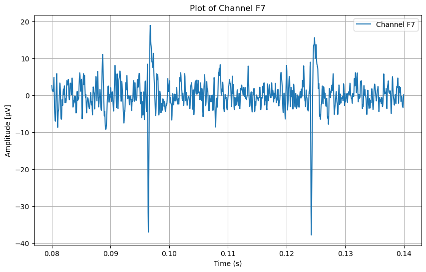
    


    
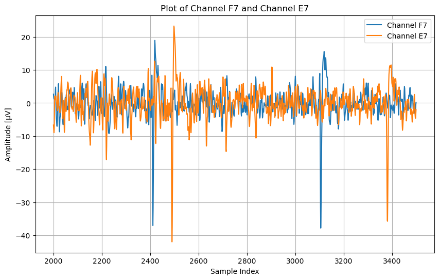
    


    

    


```python
# Plots after cleaning the noise
plot_channel(0, 'time', from_sample=2000, to_sample=3500, clean=True, mark=False)  # plot channel 0 with time on x axis
plot_two_channels(0, 29, 'sample', from_sample=2000, to_sample=3500, clean=True, mark=False)  # plot channel 0 and 29 with sample index on x axis
plot_two_channels(0, 29, 'sample', from_sample=2000, to_sample=3500, clean=True, mark=True)  # plot channel 0 and 29 with sample index on x axis

```


    
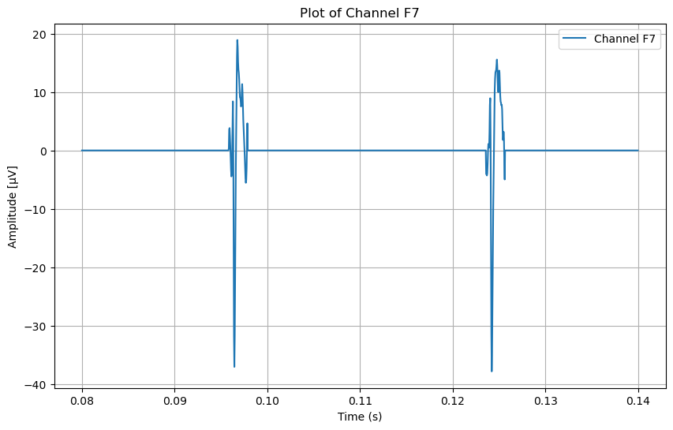
    


    
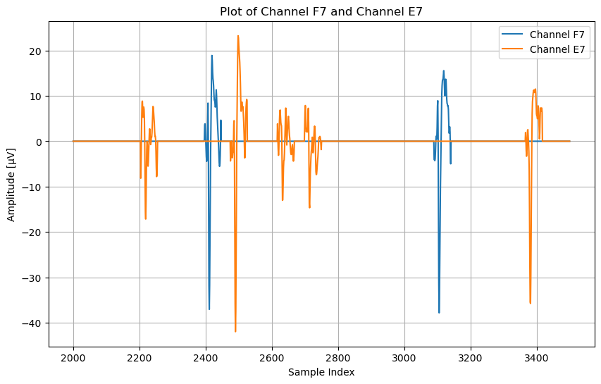
    


    
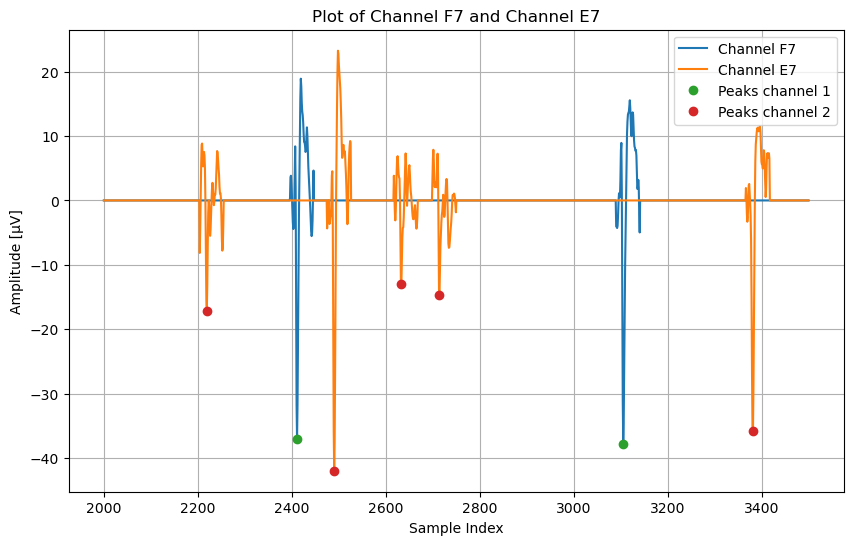
    


## Extract data

step 1 - extract the h5 files from all zip files to the MEA recordings folder


```python
# extract_zip_files()  # extract the zip files to the folder MEA recordings as h5 files
```

step 2 - extract the data from all the h5 files to 3D numpy arrays


```python
# extract_data_from_all_files()  # extract the data from all the h5 files to the npy_files folder as 3D npy arrays 
```

# Data Preparation and Custom Dataset Class

In this section, we define a custom dataset class to handle 3D data chunks and load file paths.


```python
class Custom3DDataset(Dataset):
    def __init__(self, files, chunk_size=(12, 12, 30000), transform=None):
        """
        Initializes the dataset with a list of files and prepares chunks.

        Args:
            files (list): List of tuples containing file paths and labels.
            chunk_size (tuple): The desired size of each chunk.
            transform (callable, optional): Optional transform to be applied on a sample.
        """
        self.files = files
        self.chunk_size = chunk_size
        self.transform = transform
        self.chunk_indices = []

        # Gather chunk indices for all files
        self.prepare_chunks()

    def prepare_chunks(self):
        """
        Prepares chunk indices for each file based on the chunk size.
        """
        for file_idx, (file_path, label) in enumerate(self.files):
            sample = np.load(file_path)
            total_depth = sample.shape[2]
            num_chunks = total_depth // self.chunk_size[2]

            for i in range(num_chunks):
                self.chunk_indices.append((file_idx, i, label))

    def __len__(self):
        return len(self.chunk_indices)

    def __getitem__(self, idx):
        """
        Retrieves a specific chunk based on the index.

        Args:
            idx (int): Index of the chunk to retrieve.

        Returns:
            tuple: (sample_chunk, label) where sample_chunk is the data tensor and label is its class.
        """
        file_idx, chunk_idx, label = self.chunk_indices[idx]
        file_path, _ = self.files[file_idx]
        sample = np.load(file_path)
        
        start_idx = chunk_idx * self.chunk_size[2]
        end_idx = start_idx + self.chunk_size[2]
        sample_chunk = sample[:, :, start_idx:end_idx]
        
        if self.transform:
            sample_chunk = self.transform(sample_chunk)
        
        # Add channel dimension
        sample_chunk = sample_chunk[np.newaxis, :]  
        sample_chunk = torch.tensor(sample_chunk, dtype=torch.float32)
        label = torch.tensor(label, dtype=torch.long)
        
        return sample_chunk, label

```

# Padding or Truncating Tensors

Next, we define a function to pad or truncate tensors to a target shape and a custom collate function for the DataLoader.


```python
def pad_or_truncate(tensor, target_shape):
    """
    Pads or truncates a tensor to match the target shape.

    Args:
        tensor (torch.Tensor): The tensor to pad or truncate.
        target_shape (tuple): The desired shape.

    Returns:
        torch.Tensor: The tensor after padding or truncating.
    """
    padded = torch.zeros(target_shape)
    min_shape = [min(s, t) for s, t in zip(tensor.shape, target_shape)]
    slices = tuple(slice(0, s) for s in min_shape)
    padded[slices] = tensor[slices]
    return padded


def custom_collate_fn(batch, target_shape):
    """
    Custom collate function to handle batching of samples with varying shapes.

    Args:
        batch (list): List of tuples (sample, label).
        target_shape (tuple): The desired shape for all samples in the batch.

    Returns:
        tuple: Batch of samples and labels.
    """
    samples = [pad_or_truncate(sample, target_shape) for sample, _ in batch]
    labels = [label for _, label in batch]
    samples = torch.stack(samples)
    labels = torch.tensor(labels)
    return samples, labels
```

# Loading Dataset and Splitting into Train/Validation Sets

We will now load the dataset, split it into training and validation sets, and create DataLoaders.


```python
# Function to create a pie chart for a given dataset
def create_pie_chart(sizes, labels, title):
    plt.figure(figsize=(7, 7))
    plt.pie(sizes, labels=labels, autopct='%1.1f%%', startangle=90)
    plt.axis('equal')  # Equal aspect ratio ensures that pie is drawn as a circle.
    plt.title(title)
    plt.show()

data_dir = './npy_files'  # Update this path to your data directory
chunk_size = (12, 12, 30000)

# Load all file paths and labels
w_oMNPs_dir = os.path.join(data_dir, 'w_oMNPs')
withMNPs_dir = os.path.join(data_dir, 'withMNPs')

files = []
# Load w_oMNPs files (label 0)
for filename in os.listdir(w_oMNPs_dir):
    if filename.endswith('.npy'):
        file_path = os.path.join(w_oMNPs_dir, filename)
        files.append((file_path, 0))

# Load withMNPs files (label 1)
for filename in os.listdir(withMNPs_dir):
    if filename.endswith('.npy'):
        file_path = os.path.join(withMNPs_dir, filename)
        files.append((file_path, 1))

# Print the number of files from each label
file_labels = [label for _, label in files]
file_label_counts = Counter(file_labels)
print(f"Number of files in the full dataset:")
print(f"  w/o MNPs (Label 0): {file_label_counts[0]} files")
print(f"  with MNPs (Label 1): {file_label_counts[1]} files")

# Initialize dataset
full_dataset = Custom3DDataset(files, chunk_size=chunk_size)

# Extract labels for stratification from the chunk indices
chunk_labels = [label for _, _, label in full_dataset.chunk_indices]

# Perform stratified train-validation split on chunks
train_indices, val_indices = train_test_split(
    list(range(len(full_dataset))),
    test_size=0.2,
    random_state=42,
    stratify=chunk_labels,
    shuffle=True
)

# Create Subsets for train and validation
train_dataset = Subset(full_dataset, train_indices)
val_dataset = Subset(full_dataset, val_indices)

# Define target shape for padding/truncating
target_shape = (1, 12, 12, 30000)  # Adjust this to the desired size

# Create DataLoaders with custom collate function
train_loader = DataLoader(
    train_dataset,
    batch_size=4,
    shuffle=True,
    collate_fn=lambda x: custom_collate_fn(x, target_shape)
)

val_loader = DataLoader(
    val_dataset,
    batch_size=4,
    shuffle=False,
    collate_fn=lambda x: custom_collate_fn(x, target_shape)
)

# Function to print dataset stats
def print_dataset_stats(dataset, name):
    label_counts = Counter(
        dataset.dataset.chunk_indices[idx][2]
        for idx in dataset.indices
    )
    total_chunks = len(dataset)
    print(f"{name} Dataset:")
    print(f"  Total Chunks: {total_chunks}")
    print(f"  Label 0 Chunks: {label_counts[0]}")
    print(f"  Label 1 Chunks: {label_counts[1]}")
    return label_counts

# Print stats for train and validation sets
train_label_counts = print_dataset_stats(train_dataset, "Training")
val_label_counts = print_dataset_stats(val_dataset, "Validation")

# Create pie chart with 4 segments (Train Label 0, Train Label 1, Validation Label 0, Validation Label 1)
sizes = [
    train_label_counts[0],  # Train Label 0
    train_label_counts[1],  # Train Label 1
    val_label_counts[0],    # Validation Label 0
    val_label_counts[1]     # Validation Label 1
]
labels = [
    'Train Label 0 (w/o MNPs)', 
    'Train Label 1 (with MNPs)', 
    'Validation Label 0 (w/o MNPs)', 
    'Validation Label 1 (with MNPs)'
]

# Create pie chart for the train-validation label distribution
create_pie_chart(sizes, labels, 'Train and Validation Dataset Distribution')

```

    Number of files in the full dataset:
      w/o MNPs (Label 0): 20 files
      with MNPs (Label 1): 22 files
    Training Dataset:
      Total Chunks: 3431
      Label 0 Chunks: 1673
      Label 1 Chunks: 1758
    Validation Dataset:
      Total Chunks: 858
      Label 0 Chunks: 418
      Label 1 Chunks: 440
    


    
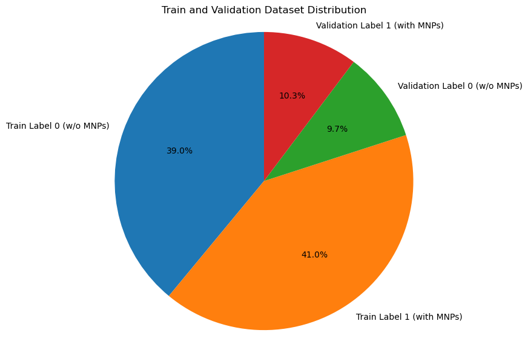
    


# Defining the CNN-LSTM Model

Here, we define a CNN-LSTM model for processing the 3D data chunks.


```python
# Define the model
class CNNLSTMModel(nn.Module):
    def __init__(self, num_classes):
        super(CNNLSTMModel, self).__init__()

        # 3D convolutional layers to extract spatial features from 3D input data.
        self.conv1 = nn.Conv3d(in_channels=1, out_channels=16, kernel_size=3, padding=1)
        self.conv2 = nn.Conv3d(in_channels=16, out_channels=32, kernel_size=3, padding=1)
        self.conv3 = nn.Conv3d(in_channels=32, out_channels=64, kernel_size=3, padding=1)

        # Max pooling layer to reduce spatial dimensions and retain important features.
        self.pool = nn.MaxPool3d(kernel_size=2, stride=2, padding=0)

        # LSTM layer to capture temporal dependencies in the data.
        # input_size is set to 64 because it's the number of channels output by the last conv layer.
        self.lstm = nn.LSTM(input_size=64, hidden_size=128, num_layers=1, batch_first=True)
        
        # Fully connected layer to map the LSTM outputs to the desired number of output classes.
        self.fc = nn.Linear(128, num_classes)

    def forward(self, x):
        x = self.pool(F.relu(self.conv1(x)))
        x = self.pool(F.relu(self.conv2(x)))
        x = self.pool(F.relu(self.conv3(x)))
        x = x.view(x.size(0), -1, x.size(1))  # Reshape for LSTM
        x, (hn, cn) = self.lstm(x)
        x = hn[-1]  # Use the last hidden state from LSTM
        x = self.fc(x)
        return x

num_classes = 2
model = CNNLSTMModel(num_classes)

# Hyperparameters
learning_rate = 0.001
num_epochs = 20

print(model)
print(f'The model has {sum(p.numel() for p in model.parameters() if p.requires_grad)} trainable parameters.')

# Loss and optimizer
criterion = nn.CrossEntropyLoss()
optimizer = torch.optim.Adam(model.parameters(), lr=learning_rate)

# Lists to store metrics
train_losses = []
train_accuracies = []
val_losses = []
val_accuracies = []

```

    CNNLSTMModel(
      (conv1): Conv3d(1, 16, kernel_size=(3, 3, 3), stride=(1, 1, 1), padding=(1, 1, 1))
      (conv2): Conv3d(16, 32, kernel_size=(3, 3, 3), stride=(1, 1, 1), padding=(1, 1, 1))
      (conv3): Conv3d(32, 64, kernel_size=(3, 3, 3), stride=(1, 1, 1), padding=(1, 1, 1))
      (pool): MaxPool3d(kernel_size=2, stride=2, padding=0, dilation=1, ceil_mode=False)
      (lstm): LSTM(64, 128, batch_first=True)
      (fc): Linear(in_features=128, out_features=2, bias=True)
    )
    The model has 169250 trainable parameters.
    

# Model Checkpointing

We will define functions to save and load model checkpoints.


```python
# Function to save model and optimizer state
def save_checkpoint(epoch, model, optimizer, train_losses, val_losses, train_accuracies, val_accuracies, filename='checkpoint.pth'):
    checkpoint = {
        'epoch': epoch,
        'model_state_dict': model.state_dict(),
        'optimizer_state_dict': optimizer.state_dict(),
        'train_losses': train_losses,
        'val_losses': val_losses,
        'train_accuracies': train_accuracies,
        'val_accuracies': val_accuracies
    }
    torch.save(checkpoint, filename)

# Function to load model and optimizer state
def load_checkpoint(filename='checkpoint.pth', load_weights_only=False):
    # With weights_only=False (default) The checkpoint will contain all serialized objects, including the model 
    # state dictionary,optimizer state dictionary, epoch, loss values, accuracies, and potentially other custom objects.
    checkpoint = torch.load(filename, weights_only=load_weights_only)  
    model.load_state_dict(checkpoint['model_state_dict'])
    optimizer.load_state_dict(checkpoint['optimizer_state_dict'])
    start_epoch = checkpoint['epoch'] + 1
    train_losses = checkpoint['train_losses']
    val_losses = checkpoint['val_losses']
    train_accuracies = checkpoint['train_accuracies']
    val_accuracies = checkpoint['val_accuracies']
    return start_epoch, train_losses, val_losses, train_accuracies, val_accuracies

# Check if there's a checkpoint available
try:
    start_epoch, train_losses, val_losses, train_accuracies, val_accuracies = load_checkpoint()
    print(f"Resuming training from epoch {start_epoch}")
except FileNotFoundError:
    start_epoch = 0
    print("Starting training from scratch")

# Plot validation results
def plot_results(y_validation, y_predicted, completed_epochs):
    # Convert lists to arrays for evaluation
    y_validation = np.array(y_validation)
    y_predicted = np.array(y_predicted)

    # Print confusion matrix and classification report
    print('Confusion matrix on validation set:\n')

    # Print the confusion matrix with headers
    print(pd.DataFrame(confusion_matrix(y_validation, y_predicted), 
                       index=['Actual 0', 'Actual 1'],columns=['Predicted 0', 'Predicted 1']))

    print(f"\nClassification report:\n{classification_report(y_validation, y_predicted)}")

    # Plotting training and validation loss/accuracy
    epochs = range(1, completed_epochs + 1)

    plt.figure(figsize=(12, 4))

    plt.subplot(1, 2, 1)
    plt.plot(epochs[:len(train_losses)], train_losses, 'b', label='Training Loss')
    plt.plot(epochs[:len(val_losses)], val_losses, 'r', label='Validation Loss')
    plt.title('Loss')
    plt.xlabel('Epochs')
    plt.ylabel('Loss')
    plt.legend()

    plt.subplot(1, 2, 2)
    plt.plot(epochs[:len(train_accuracies)], train_accuracies, 'b', label='Training Accuracy')
    plt.plot(epochs[:len(val_accuracies)], val_accuracies, 'r', label='Validation Accuracy')
    plt.title('Accuracy')
    plt.xlabel('Epochs')
    plt.ylabel('Accuracy (%)')
    plt.legend()

    plt.tight_layout()
    plt.show()

```

    Resuming training from epoch 8
    

# Training and Validation Loop

We define the training and validation loop for the model.


```python
class EarlyStopping:
    def __init__(self, patience=5, min_delta=0):
        """
        Early stopping to stop training when the loss does not improve after a certain patience.

        Args:
            patience (int): How long to wait after last time validation loss improved.
                            Default: 5
            min_delta (float): Minimum change in the monitored quantity to qualify as an improvement.
                            Default: 0
        """
        self.patience = patience
        self.min_delta = min_delta
        self.best_loss = np.Inf
        self.counter = 0
        self.early_stop = False

    def __call__(self, val_loss):
        if val_loss < self.best_loss - self.min_delta:
            self.best_loss = val_loss
            self.counter = 0  # Reset counter if validation loss improves
        else:
            self.counter += 1  # Increase counter if no improvement
            if self.counter >= self.patience:
                self.early_stop = True  # Stop if patience limit is reached

```


```python
# Check if CUDA is available and set the device
device = torch.device('cuda' if torch.cuda.is_available() else 'cpu')

# Move the model to the device (GPU if available)
model = model.to(device)

# Initialize early stopping
early_stopping = EarlyStopping(patience=5, min_delta=0.001)

# Training loop
for epoch in range(start_epoch, num_epochs):
    model.train()
    running_loss = 0.0
    correct_train = 0
    total_train = 0
    for inputs, labels in tqdm(train_loader, desc=f'Epoch {epoch + 1}/{num_epochs}', unit='batch'):
        optimizer.zero_grad()  # Zero the parameter gradients
        outputs = model(inputs)  # Forward pass
        loss = criterion(outputs, labels)  # Compute loss
        loss.backward()  # Backward pass
        optimizer.step()  # Optimize the parameters
        running_loss += loss.item()
        _, predicted = torch.max(outputs.data, 1)
        total_train += labels.size(0)
        correct_train += (predicted == labels).sum().item()

    train_loss = running_loss / len(train_loader)
    train_losses.append(train_loss)
    train_accuracy = 100 * correct_train / total_train
    train_accuracies.append(train_accuracy)
    print(f'Epoch {epoch + 1}/{num_epochs}, Loss: {train_loss:.4f}, Accuracy: {train_accuracy:.4f}%')

    # Validation loop
    model.eval()
    val_loss = 0.0
    correct_val = 0
    total_val = 0
    
    # Lists to store true and predicted labels
    y_validation = []
    y_predicted = []

    with torch.no_grad():
        for inputs, labels in tqdm(val_loader, desc='Validation', unit='batch'):
            outputs = model(inputs)
            loss = criterion(outputs, labels)
            val_loss += loss.item()

            _, predicted = torch.max(outputs.data, 1)

            total_val += labels.size(0)
            correct_val += (predicted == labels).sum().item()

            # Append true and predicted labels for confusion matrix and report
            y_validation.extend(labels.cpu().numpy())
            y_predicted.extend(predicted.cpu().numpy())

    val_loss /= len(val_loader)
    val_losses.append(val_loss)
    val_accuracy = 100 * correct_val / total_val
    val_accuracies.append(val_accuracy)

    print(f'Validation Loss: {val_loss:.4f}, Accuracy: {val_accuracy:.4f}%')

    # Early stopping check
    early_stopping(val_loss)
    if early_stopping.early_stop:
        print(f"Early stopping triggered at epoch {epoch + 1}")
        break

    # Save the model and optimizer state
    save_checkpoint(epoch, model, optimizer, train_losses, val_losses, train_accuracies, val_accuracies)
    
    #Plot current results
    plot_results(y_validation, y_predicted, epoch + 1)

# Save the number of completed epochs for plotting
completed_epochs = epoch + 1  # Store how many epochs were actually run
```

    Epoch 9/20: 100%|███████████████████████████████████████████████████████████████| 858/858 [8:13:39<00:00, 34.52s/batch]
    

    Epoch 9/20, Loss: 0.0847, Accuracy: 96.9105%
    

    Validation: 100%|███████████████████████████████████████████████████████████████| 215/215 [1:23:09<00:00, 23.21s/batch]
    

    Validation Loss: 0.1189, Accuracy: 96.1538%
    Confusion matrix on validation set:
    
              Predicted 0  Predicted 1
    Actual 0          410            8
    Actual 1           25          415
    
    Classification report:
                  precision    recall  f1-score   support
    
               0       0.94      0.98      0.96       418
               1       0.98      0.94      0.96       440
    
        accuracy                           0.96       858
       macro avg       0.96      0.96      0.96       858
    weighted avg       0.96      0.96      0.96       858
    
    


    
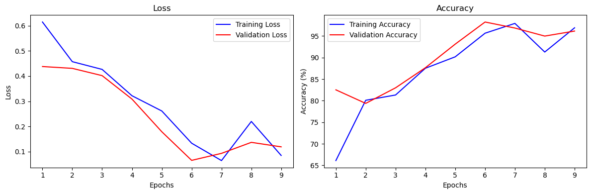
    


    Epoch 10/20: 100%|██████████████████████████████████████████████████████████████| 858/858 [7:44:09<00:00, 32.46s/batch]
    

    Epoch 10/20, Loss: 0.0666, Accuracy: 98.0472%
    

    Validation: 100%|████████████████████████████████████████████████████████████████████████████| 215/215 [1:19:50<00:00, 22.28s/batch]
    

    Validation Loss: 0.0568, Accuracy: 97.7855%
    Confusion matrix on validation set:
    
              Predicted 0  Predicted 1
    Actual 0          403           15
    Actual 1            4          436
    
    Classification report:
                  precision    recall  f1-score   support
    
               0       0.99      0.96      0.98       418
               1       0.97      0.99      0.98       440
    
        accuracy                           0.98       858
       macro avg       0.98      0.98      0.98       858
    weighted avg       0.98      0.98      0.98       858
    
    


    
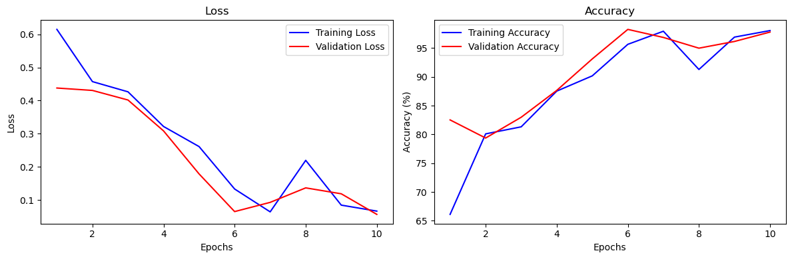
    


    Epoch 11/20: 100%|███████████████████████████████████████████████████████████████████████████| 858/858 [7:48:49<00:00, 32.78s/batch]
    

    Epoch 11/20, Loss: 0.0556, Accuracy: 98.3678%
    

    Validation: 100%|████████████████████████████████████████████████████████████████████████████| 215/215 [1:22:38<00:00, 23.06s/batch]
    

    Validation Loss: 0.0800, Accuracy: 97.3193%
    Confusion matrix on validation set:
    
              Predicted 0  Predicted 1
    Actual 0          397           21
    Actual 1            2          438
    
    Classification report:
                  precision    recall  f1-score   support
    
               0       0.99      0.95      0.97       418
               1       0.95      1.00      0.97       440
    
        accuracy                           0.97       858
       macro avg       0.97      0.97      0.97       858
    weighted avg       0.97      0.97      0.97       858
    
    


    
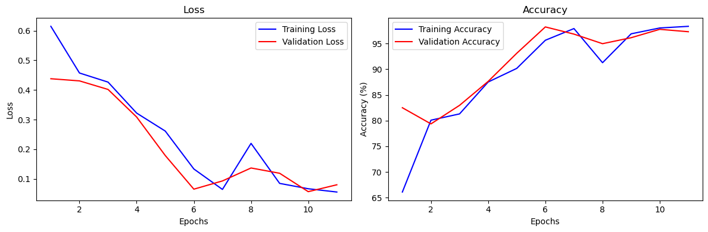
    


    Epoch 12/20: 100%|███████████████████████████████████████████████████████████████████████████| 858/858 [8:35:54<00:00, 36.08s/batch]
    

    Epoch 12/20, Loss: 0.0555, Accuracy: 98.3387%
    

    Validation: 100%|████████████████████████████████████████████████████████████████████████████| 215/215 [1:30:03<00:00, 25.13s/batch]
    

    Validation Loss: 0.0595, Accuracy: 98.3683%
    Confusion matrix on validation set:
    
              Predicted 0  Predicted 1
    Actual 0          406           12
    Actual 1            2          438
    
    Classification report:
                  precision    recall  f1-score   support
    
               0       1.00      0.97      0.98       418
               1       0.97      1.00      0.98       440
    
        accuracy                           0.98       858
       macro avg       0.98      0.98      0.98       858
    weighted avg       0.98      0.98      0.98       858
    
    


    
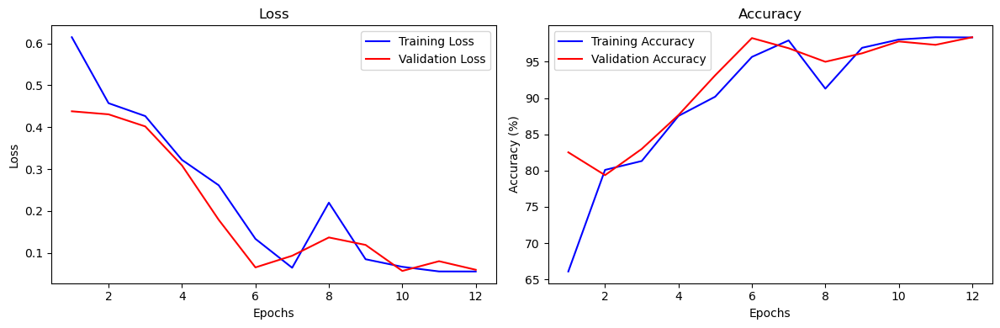
    


    Epoch 13/20: 100%|███████████████████████████████████████████████████████████████████████████| 858/858 [9:59:48<00:00, 41.94s/batch]
    

    Epoch 13/20, Loss: 0.0521, Accuracy: 98.6593%
    

    Validation: 100%|████████████████████████████████████████████████████████████████████████████| 215/215 [1:34:33<00:00, 26.39s/batch]
    

    Validation Loss: 0.0629, Accuracy: 97.9021%
    Confusion matrix on validation set:
    
              Predicted 0  Predicted 1
    Actual 0          402           16
    Actual 1            2          438
    
    Classification report:
                  precision    recall  f1-score   support
    
               0       1.00      0.96      0.98       418
               1       0.96      1.00      0.98       440
    
        accuracy                           0.98       858
       macro avg       0.98      0.98      0.98       858
    weighted avg       0.98      0.98      0.98       858
    
    


    
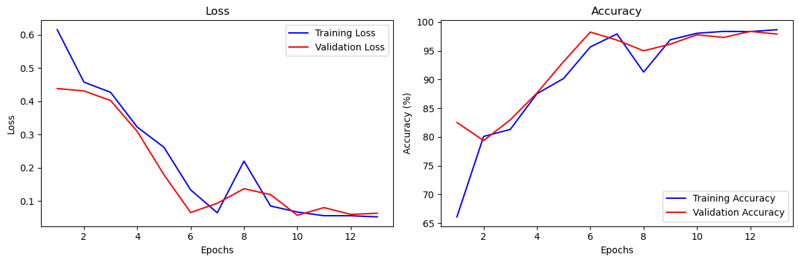
    


    Epoch 14/20: 100%|███████████████████████████████████████████████████████████████████████████| 858/858 [8:42:27<00:00, 36.54s/batch]
    

    Epoch 14/20, Loss: 0.0402, Accuracy: 99.0090%
    

    Validation: 100%|████████████████████████████████████████████████████████████████████████████| 215/215 [1:19:23<00:00, 22.15s/batch]
    

    Validation Loss: 0.0671, Accuracy: 98.1352%
    Confusion matrix on validation set:
    
              Predicted 0  Predicted 1
    Actual 0          408           10
    Actual 1            6          434
    
    Classification report:
                  precision    recall  f1-score   support
    
               0       0.99      0.98      0.98       418
               1       0.98      0.99      0.98       440
    
        accuracy                           0.98       858
       macro avg       0.98      0.98      0.98       858
    weighted avg       0.98      0.98      0.98       858
    
    


    
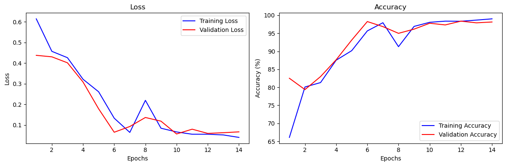
    


    Epoch 15/20: 100%|███████████████████████████████████████████████████████████████████████████| 858/858 [7:59:52<00:00, 33.56s/batch]
    

    Epoch 15/20, Loss: 0.0669, Accuracy: 97.9015%
    

    Validation: 100%|████████████████████████████████████████████████████████████████████████████| 215/215 [1:13:11<00:00, 20.43s/batch]

    Validation Loss: 0.3042, Accuracy: 88.3450%
    Early stopping triggered at epoch 15
    

    
    

# Plotting Training and Validation Metrics

Finally, we will plot the confusion_matrix, classification_report, training and validation loss and accuracy over epochs.


```python
plot_results(y_validation, y_predicted, completed_epochs)
```

    Confusion matrix on validation set:
    
              Predicted 0  Predicted 1
    Actual 0          318          100
    Actual 1            0          440
    
    Classification report:
                  precision    recall  f1-score   support
    
               0       1.00      0.76      0.86       418
               1       0.81      1.00      0.90       440
    
        accuracy                           0.88       858
       macro avg       0.91      0.88      0.88       858
    weighted avg       0.91      0.88      0.88       858
    
    


    
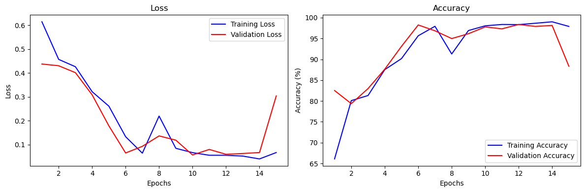
    

