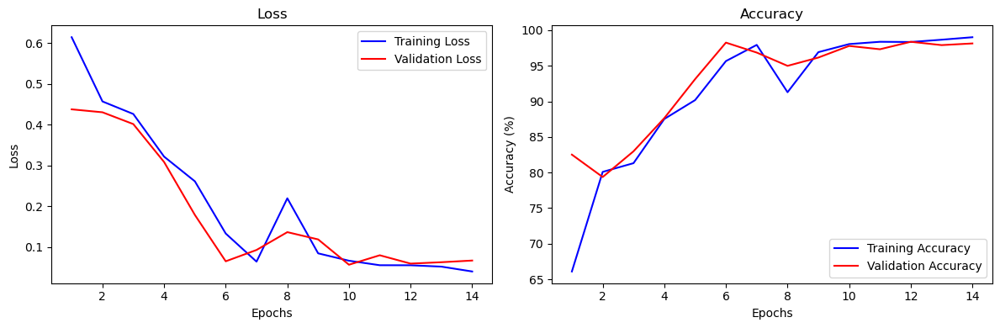
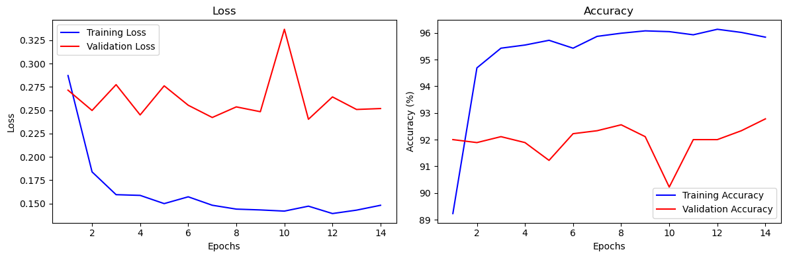

# MEA Data Classification with CNN-LSTM

This project preprocesses MEA (Microelectrode Array) recordings and classifies data into two categories: 'w_oMNPs' and 'withMNPs' using a CNN-LSTM model.

## Table of Contents
- [Project Overview](#project-overview)
- [Model Architecture](#model-architecture)
- [Results second version](#results-second-version)
- [Results base version](#results-base-version)

## Project Overview
This project involves the following steps:
1. **Data Extraction & Preprocessing**: MEA recordings are extracted from `.zip` files to 'h5' files, converted into 3D arrays, and visualized.
2. **Model Development**: A 3D CNN-LSTM model is built using PyTorch to classify the preprocessed data.
3. **Evaluation**: The model is evaluated on new datasets with confidence scores.

## Model Architecture
The model consists of the following layers:
- 3 Conv3D layers with increasing channels: (16, 32, 64).
- MaxPool3D layer for downsampling.
- LSTM with input size of 64 and hidden size of 128.
- Fully connected layer for final classification.

## Results second version:
This version of the model in the 'MNPs_Classifier(2)' file - classifies each chunk instead of each file and stratifies based on the number of chunks(instead of number of files).
The attach results are the results of this version on validation set: 

    Validation Loss: 0.0671, Accuracy: 98.1352%
    Confusion matrix on validation set:
    
              Predicted 0  Predicted 1
    Actual 0          408           10
    Actual 1            6          434
    
    Classification report:
                  precision    recall  f1-score   support
    
               0       0.99      0.98      0.98       418
               1       0.98      0.99      0.98       440
    
        accuracy                           0.98       858
       macro avg       0.98      0.98      0.98       858
    weighted avg       0.98      0.98      0.98       858
    
    
    

This version had problem with misclassification of a new file:
Files of "w_oMNPs" files (label 0) classified as "withMNPs" (label 1), along with the prediction confidence hovering around 50%,
suggests that the model is not confidently distinguishing between the two classes in new data.

---
## Results base version:
The first version in the 'MNPs_Classifier(1)' file got the following results (but succeeded much better in classify a new file):

    Validation Loss: 0.2518, Accuracy: 92.7778%
    Confusion matrix on validation set:
    
              Predicted 0  Predicted 1
    Actual 0          340           60
    Actual 1            5          495
    
    Classification report:
                  precision    recall  f1-score   support
    
               0       0.99      0.85      0.91       400
               1       0.89      0.99      0.94       500
    
        accuracy                           0.93       900
       macro avg       0.94      0.92      0.93       900
    weighted avg       0.93      0.93      0.93       900
    
    
    

New File Classification Results:

Files predicted as w_oMNPs (Class 0):  High confidence, ranging from 0.91 to 0.97.

Files predicted as withMNPs (Class 1): Confidence varies, generally lower for withMNPs predictions (0.83 to 0.92).
 
---
